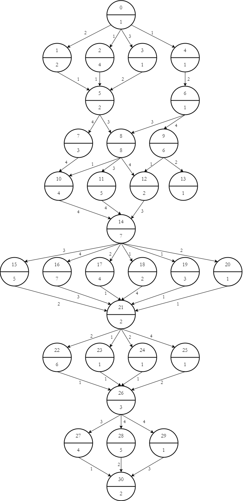
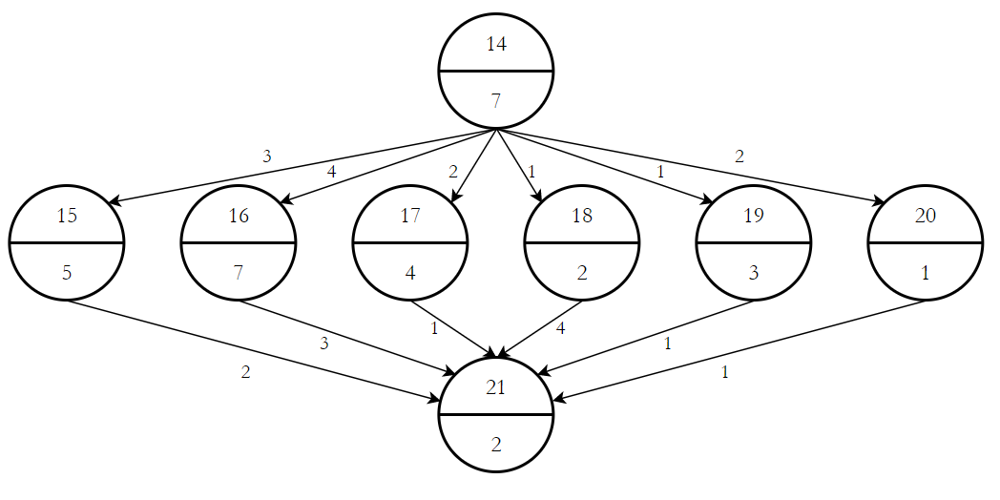
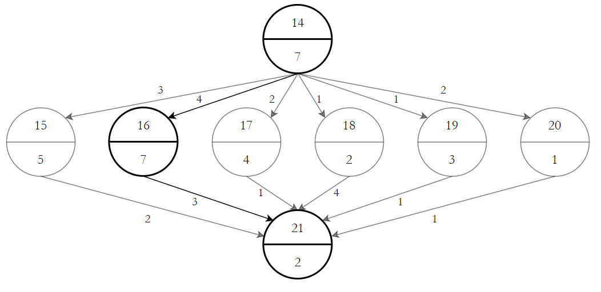
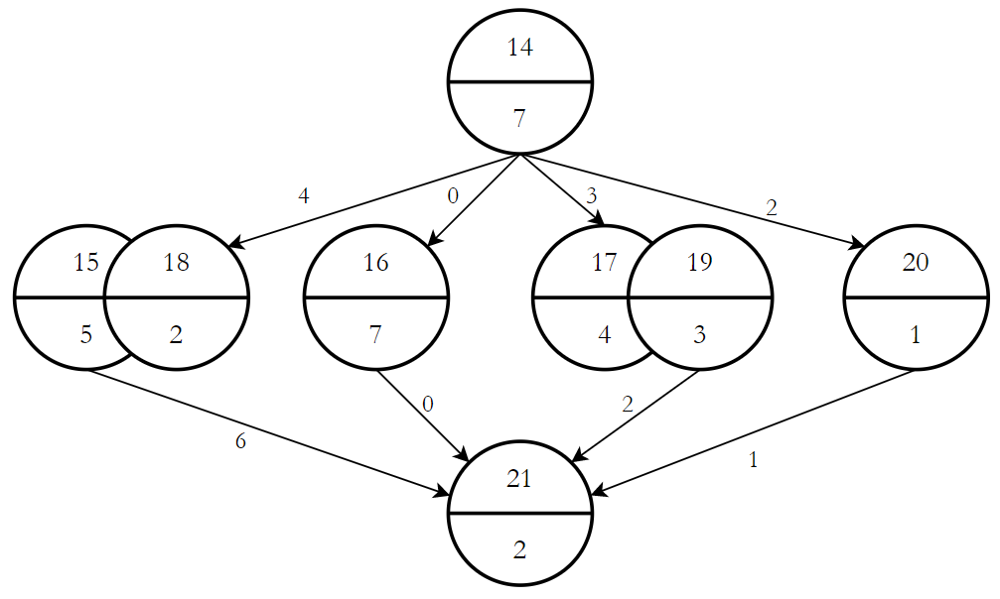
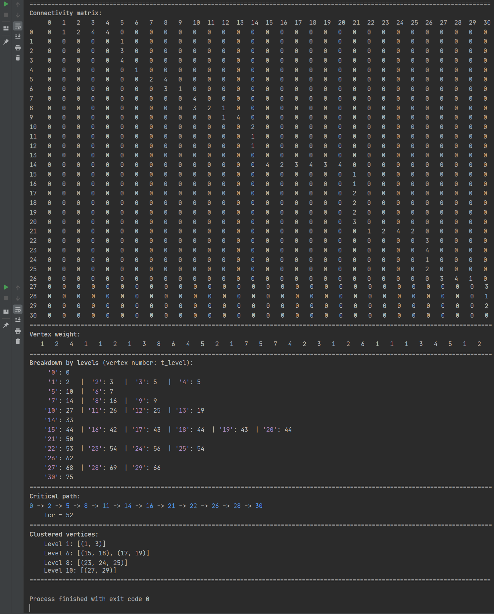

<h1 align="center">Dynamic and Static Planning</h1>
Write a program that implements one of the algorithms of dynamic or static planning.

<h2 align="center">📝 Task</h2>

Develop a program for selecting vertices that have a sign of implicit transition (the number of vertices is not less than 30).

<h2 align="center">📙 Description</h2>

The source information for structural analysis is a graph of the problem, presented in a tiered-parallel form. Each vertex of the original graph after analysis is marked and assigned the sign of "transition".

General algorithm for solving this problem:

1. Identify a critical path;
2. Cluster implicit transition vertices. This is done in order to group implicit transition vertices and thus reduce the width of the graph, and hence the number of processors.

The following graph was used to test the program part:

  

Critical path: `0 → 2 → 5 → 8 → 11 → 14 → 16 → 21 → 22 → 26 → 28 → 30`

Let's check the accuracy on a graph of lower dimension:

  

Now we choose the critical path:

  

<tt>Tcr = 7 + 7 + 2 = 16</tt>

Zeroing the critical path and clusterize the vertices:

  

<tt>Tcr = 7 + 7 + 2 = 16</tt>

After clasterisation `Tcr` did not increase, which confirms the correctness of the work. The program found the critical path and clustered the vertices in the same way. Screenshot of the implementation are given below.

<h2 align="center">📷 Results</h2>

  

